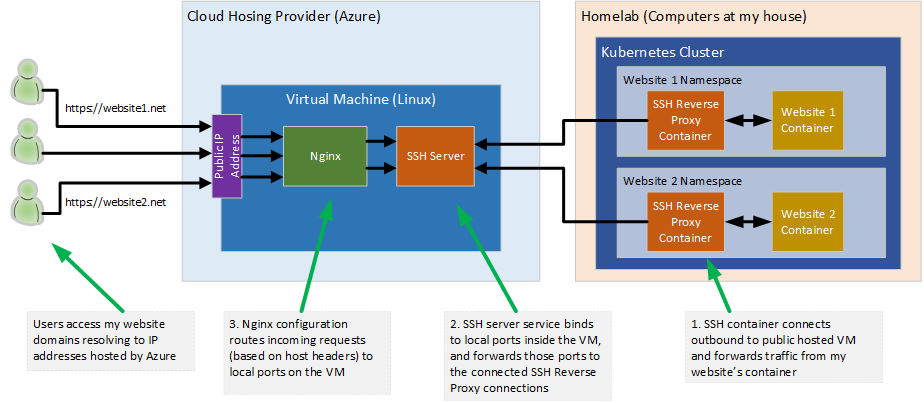

# sshReverseProxy
Simple docker container used to reverse-proxy other (website) containers to an upstream ssh server.  This is useful for sending 



## Using the Docker Image

The docker image uses a handful of environment variables to configure the local container it should be proxying data to, as well as information about the upstream server.  You'll need to create a certificate used to log into the upstream ssh server which will be attached to our reverse proxy container as well.  I'll defer to [this great article](https://www.howtoforge.com/reverse-proxy-for-https-ssh-and-mysql-mariadb-using-nginx/) for getting the overall ssh reverse proxying in place.

### Environment Variables

- SSH_HOST = Upstream SSH server to which we'll be connecting
- SSH_PORT = TCP port which will be bound to locally on the upstream SSH server
- PATH_TO_SSH_KEY = Path within the sshReverseProxy where an SSH key has been volume mounted
- CONTAINER_HOST = Hostname for the local container that we'll be connecting to
- CONTAINER_PORT = TCP (HTTP) port exposed on the local container

### Docker Run Example

This example assumes an ssh key named id_rsa has been created on the host in the /mnt/website/ssh_creds folder.

```
docker run -d -v /mnt/website/ssh_creds:/ssh -e PATH_TO_SSH_KEY=/ssh/id_rsa -e SSH_HOST=129.91.122.201 -e SSH_PORT=20001 -e CONTAINER_HOST=wordpress -e CONTAINER_PORT=80
```

### Docker Compose Example

In the root of this repository I've included a sample docker-compose.yml that shows a simple configuration of a wordpress website, the ssh reverse proxy, and an autohealer that watches for the correct operation of the website and restarts the ssh proxy if the site stops working.  In Kubernetes we have real health checks, but in the Docker environment I was using before moving to Kubernetes I used this to catch when the SSH tunnel jameed up.  It wasn't often, but it happened a few times.


## Building the Docker Image

To build this image, on a machine with Docker installed simply run the following command from within the downloaded repository directory:

```
docker build -t sshReverseProxy:latest .
```